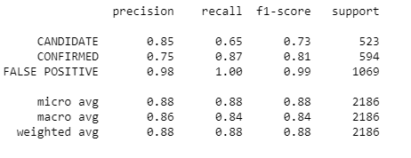
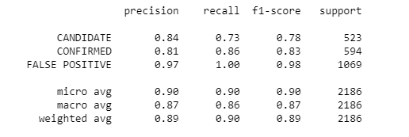

# Exoplanet Exploration

Do you know what an Exoplanet is?

An Exoplanet (Extrasolar planet) is a planet that exists outside
our solar system. Many exoplanets have been discovered over the
years by Nasa’s Kepler telescope. Scientists discovered a very
efficient way to study these occurrences; planets themselves do
not emit light, but the stars that orbit them do. If you study and
watch these stars over time there may be a regular dimming of their
flux (The light intensity). That’s enough evidence to say that there
is an orbiting body near the star. Further studies of the candidate
system capture light at a different wavelength, could solidify the
belief or confirm the existence of these orbiting bodies.

-------------------------------------------------------------------------------
Summary
Random Forest is better than Support Vector Machine, even without GridSearchCV.

-------------------------------------------------------------------------------
# Support Vector Machine

-------------------------------------------------------------------------------
# Random Forest

_______________________________________________________________________________

